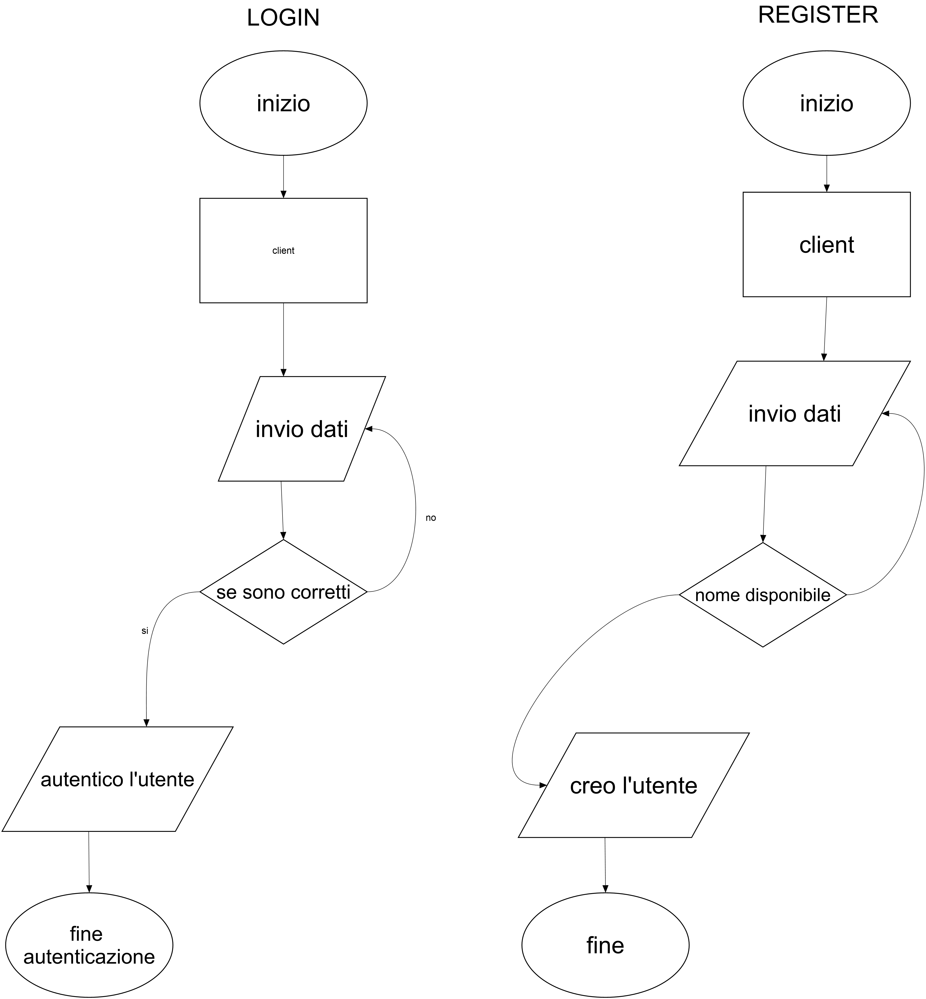
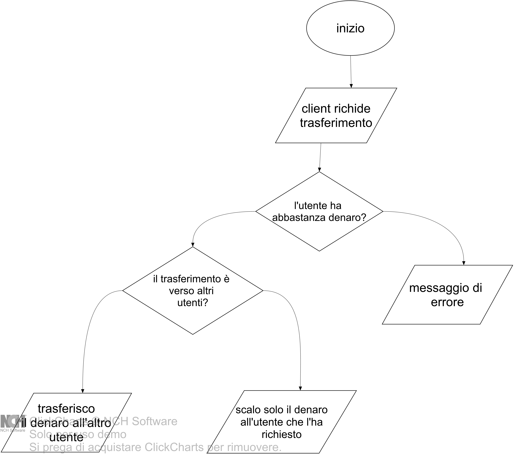

# Progetto "Sistema Bancario Emulato"

"Sistema Bancario Emulato", creato come compito scolastico per il 16/02/2024.

### Descrizione

Questo codice emula un sistema bancario grezzo, sviluppato principalmente in C++ (perchè dovevo), il codice è stato completamente riscritto perché ero partito dallo sviluppare il tutto in python, dato che è un linguaggio più semplice. Il codice si basa sull'utilizzo del modulo socket: client e server.

### Note, Caratteristiche e Limitazioni

- Il source code del lato server non è incluso poiché non sono riuscito a renderlo leggibile nei tempi prestabiliti, il lato server però, a parer mio non rientra in ciò che dovevo presentare.
- Sono state utilizzate risorse prese da internet per capire come scrivere un programma con il modulo socket in C++, poiché la sintassi risultava difficile da comprendere.
- Il database è implementato utilizzando un file JSON. Anche se sarebbe stato preferibile utilizzare un database MySQL, le mie limitate capacità in C++ hanno però portato a questa soluzione (molto più semplice).
- Il sistema presenta numerose falle nella sicurezza (è scritto da cani ed il server potrebbe crasciare quando un client si disconnete in maniera sbagliata).
- Sono presenti alcuni bug nel calcolo del denaro da restituire all'utente.
- Mancano le funzionalità amministrative, come un utente (admin) in grado di aggiungere bilancio tramite un deposito.
- Maca il tempo di sistemare tutto 
- Per il feBug non nascondo di aver utilizzato Chat-GPT  

### Funzionamento:
#### come vengono gestiti i dati: 

In breve la creazione di una comunicazione socket si puo dividere in questo modo:

- Creazione dei socket: Il server crea un socket e lo mette in ascolto su una determinata porta. Il client crea un proprio socket per comunicare con il server.

- Connessione: Il client stabilisce una connessione con il server specificando l'indirizzo IP e la porta su cui il server è in ascolto.

- Scambio di dati: Una volta stabilita la connessione, sia il client che il server possono inviare e ricevere dati tramite i rispettivi socket. I dati possono essere inviati in pacchetti o flussi, a seconda della configurazione della comunicazione.

- Chiusura della connessione: Una volta completato lo scambio di dati, il client o il server possono chiudere la connessione. Questo termina la comunicazione tra le due parti.

#### Sistema di login:
In breve il server come prima cosa ha bisongo di identificare l'utente, quindi parte immediatamente la fase di autenticazione:
Il client può mandare in base alle esigenze 2 tipi di richiesta login o register ed il server le riconosce in maniera abbastanza banale, l'istruzione puo essere fatta i solo 2 modi login[user,pass] o register[user,pass], nel caso del login il server controlla l'esistenza del nomeutente nel database e poi ne convalida la passworld, nel caso del register invece viene creato un nuovo utente.

#### Trasferimenti:
Tutto questo progetto si basa sul trasferimento di bilancio tra utenti (anche la banca stessa nel caso del ritiro), il funzionamento anche qui è abbastanza banale, all'interno del codice viene chiamata una funzione con dei parametri dove vengono passate più informazioni, tra qui: nome utente, bilancio e connection, il client spedisce le informazioni al server che detrae il bilancio dal database e nel caso di trasferimento verso altri unnteti lo accredita verso un altra persona

#### Esempio vurnerabilità di questo codice: (semplice)
Il modo più semplice per violare un programma del genere (senza alcuna protezione) è essere nella stessa rete della persona che si deve autenticare, analizzando il traffico infatti si potrà vedere il mesaggio di autenticazione in chiaro senza alcun tipo di protezione

## ISTRUZIONI:
Andare nella cartella Compiled ed assicurarsi di avviare prima server e solo dopo client 